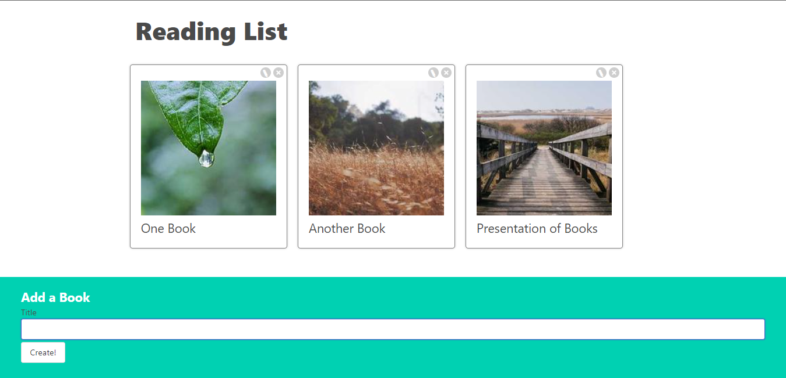

# Books App

## Description

The "Books App" is a simple React-based web application that allows users to manage a list of books. Users can add books with randomized pictures and titles, edit existing book titles, and view their book collection. All book data is stored in the backend using a `db.json` file.

## Features

- Add books with randomized pictures and titles.
- Edit book titles and update them in the backend.
- View and manage your collection of books.
- Backend storage using `db.json` for data persistence.

## Installation

To run this app locally, follow these steps:

1. Clone this repository to your local machine.

git clone https://github.com/Djomlica/books-app__react

2. Navigate to the project directory.

3. Install the required dependencies.

npm install

4. Start the development server.

5. Open your web browser and visit [http://localhost:3000](http://localhost:3000) to use the app.

6. To run the backend server, open a new terminal window and navigate to the project directory.

7. Start the backend server.

npm run server

## Technologies Used

- React
- JSON Server (for backend)
- Random Image Generation

## Usage

1. On the app's landing page, you can add a new book by entering a title in the input field and clicking the "Create!" button. A random image will be generated with the Title you typed for the book, and it will be added to your collection.

2. To edit a book's title, click the "Pencil" button on the book card, update the title in the input field, and click the "Save" button. The title will be updated in the backend.

3. View and manage your collection of books on the main page.

## Contributing

If you would like to contribute to this project, please follow these steps:

1. Fork the repository.
2. Create a new branch for your feature or bug fix.
3. Make your changes and commit them.
4. Push your changes to your fork.
5. Submit a pull request to the original repository.

## License

This project is licensed under the GDU License - see the [LICENSE.md](LICENSE.md) file for details.
